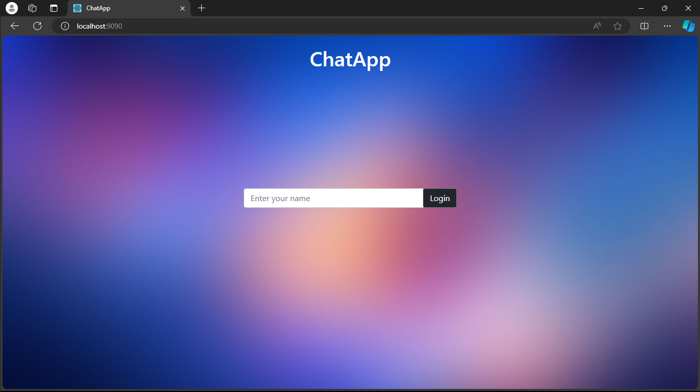
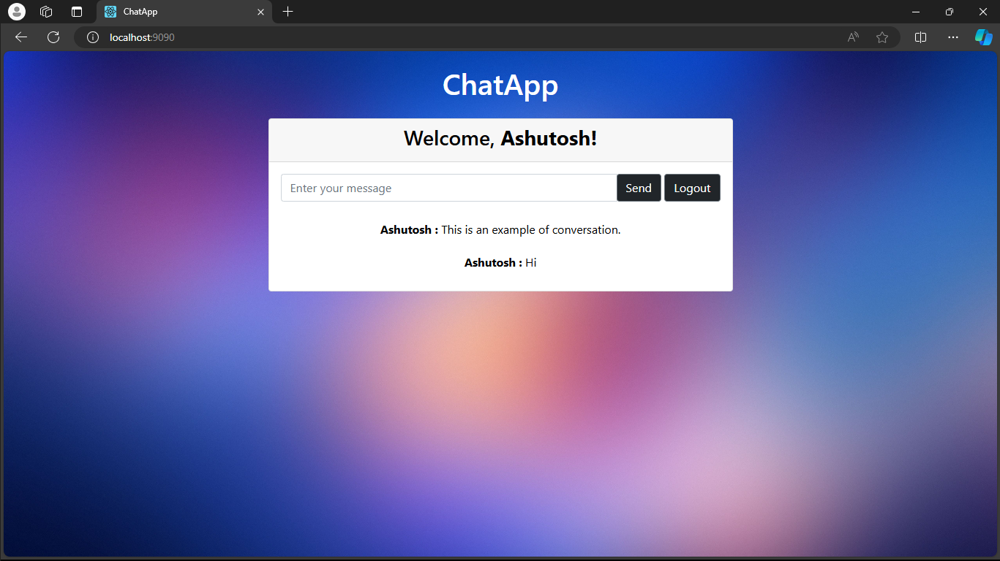

# ChatApp

## Project Overview

Welcome to **ChatApp**, a real-time chat room application built using Java and Spring Boot WebSocket. This application allows users to log in with a username and communicate with each other in real-time through a modern, intuitive interface.

## Features

- User Login
- Real-time Messaging with WebSocket
- User-friendly Interface

## Prerequisites

- Java Development Kit (JDK) 8 or higher
- IDE (Eclipse, IntelliJ IDEA, or NetBeans recommended)
- [Spring Initializr](https://start.spring.io/) for generating Spring Boot project structure
- Maven

## Installation and Setup

### 1. Generate the Spring Boot Project

Visit [Spring Initializr](https://start.spring.io/) and generate a new project with the following configurations:
- Project: Maven Project
- Language: Java
- Spring Boot: Latest stable version
- Group: com.chatapp (or your preferred group)
- Artifact: ChatApp (or your preferred artifact name)
- Dependencies: Spring Web, Spring Boot DevTools, Spring Websocket, Thymeleaf (optional for web UI)

Download and extract the generated project.

### 2. Clone the Repository

```sh
git clone https://github.com/ashutoshh-17/ChatApp.git
cd ChatApp
```

### 3. Configure the Application

Update the application configuration in the `application.properties` file located in `src/main/resources` if necessary. However, no database configuration is needed for this project as it operates without a database.

### 4. Build and Run the Application

Compile and run the project using Maven:

```sh
mvn clean install
mvn spring-boot:run
```

## Usage

### 1. Login

Open the application in your web browser and navigate to the "Login" page. Enter your username to log in. No registration or password is required.

### 2. Start Chatting

Once logged in, you can start chatting with other users. Select a chat room or user to chat with and start sending messages in real-time.

## Screenshots

<p align="center">
  
  
</p>

## File Structure

```
ChatApp/
│
├── src/
│   ├── main/
│   │   ├── java/com/chatapp/
│   │   │   ├── ChatAppApplication.java
│   │   │   ├── config/
│   │   │   │   ├── WebSocketConfig.java
│   │   │   ├── controller/
│   │   │   │   ├── ChatController.java
│   │   │   ├── model/
│   │   │   │   ├── Message.java
│   │   │   │   ├── User.java
│   │   │   ├── service/
│   │   │   │   ├── MessageService.java
│   │   │   │   ├── UserService.java
│   │   ├── resources/
│   │   │   ├── application.properties
│   │   │   ├── static/
│   │   │   │   ├── css/
│   │   │   │   ├── js/
│   │   │   ├── templates/
│   │   │       ├── login.html
│   │   │       ├── chat.html
│
├── screenshots/
│   ├── login.png
│   ├── chat.png
│
├── .gitignore
├── README.md
└── pom.xml
```

## Contributing

We welcome contributions! Please fork the repository and submit a pull request with your changes.


## Contact

For any questions or feedback, please feel free to contact me.

---

Thank you for using ChatApp! Enjoy your chatting experience.
